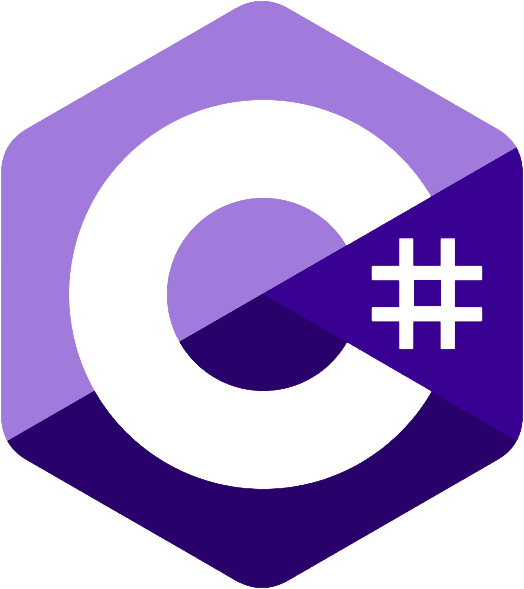

<p align="center">
    <a href="https://github.com/TheArchitect123"></a>
</p>

<p align="center">
A lightweight library to generate keys commonly used for the terra ecosystem. RawKey, Mnemonic & CLI Key
</p>
<br/>

<p align="center">
  <a href="https://github.com/TerraMystics/Terra.Microsoft.Keys/blob/main/LICENSE.md">
  
  </a>

  <a href="https://www.nuget.org/packages/Terra.Microsoft.Keys/1.0.0">
    
  </a>
  
  <a href="https://www.nuget.org/packages/Terra.Microsoft.Keys/1.0.0">
    
  </a>
</p>

<p align="center">
  <a href="https://docs.terra.money/develop/feather-js/keys"><strong>Explore the Docs »</strong></a>
  <br />
</p>

## Features

- **Written in C#**, with type definitions
- Easy key management for anyone building on the Terra Ecosystem
- Works with all .Net Environments

## Installation & Configuration

Grab the latest version off [Nuget](https://www.nuget.org/packages/TerraMystics/1.0.0)

```sh
dotnet add package Terra.Microsoft.Keys
```

Please make sure to add the following nuget Packages into your .csproj file
```sh
<ItemGroup>
    <PackageReference Include="Cryptography.ECDSA.Secp256k1" Version="1.1.3" />
    <PackageReference Include="NBitcoin" Version="7.0.23" />
    <PackageReference Include="RandomStringCreator" Version="2.0.0" />
    <PackageReference Include="System.Security.Cryptography.Algorithms" Version="4.3.1" />
    <PackageReference Include="Terra.Microsoft.Extensions" Version="1.0.1" />
    <PackageReference Include="Terra.Microsoft.ProtoBufs" Version="1.0.1" />
  </ItemGroup>
```

## Usage

Terra.Microsoft.Keys can be used for Mobile & Web Developers, or SDK Developers looking to extend the Terra Platform. Supports all Microsoft Technologies from Xamarin, MAUI, ASP & Unity.

### Generating a Mnemonic Key

Below we're going to pull balance information on a sample wallet.
```cs
async MnemonicKey GenerateMnemonic() {
  // Create a key out of a mnemonic string (recovery words)
    return new MnemonicKey("notice oak worry limit wrap speak medal online prefer cluster roof addict wrist behave treat actual wasp year salad speed social layer crew genius");
}
```

## Terra.Microsoft.Keys For Unity Developers

If you are using Terra.Microsoft.Keys for Unity, please make sure to install the [following asset](https://github.com/TerraMystics/NuGetForUnity) in your project, and follow the installation instructions above

## License

This software is licensed under the MIT license. See [LICENSE](./LICENSE) for full disclosure.

© 2022 TerraMystics.
